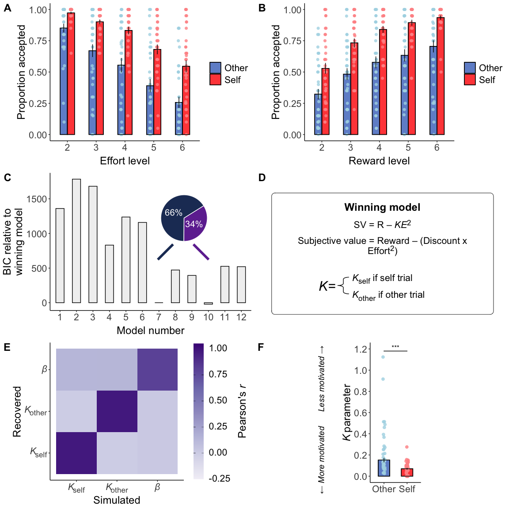
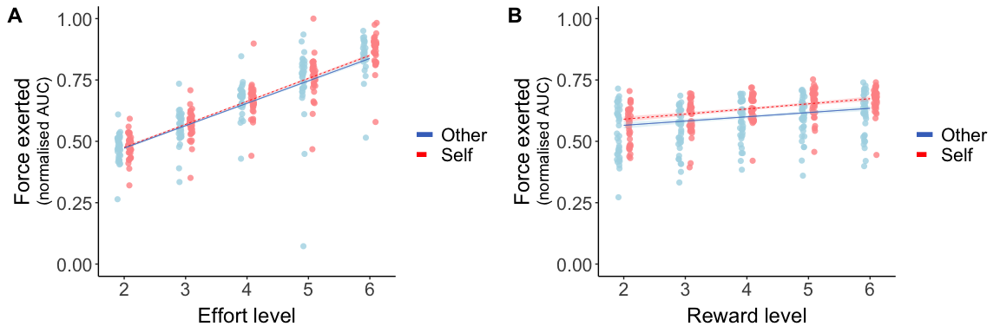
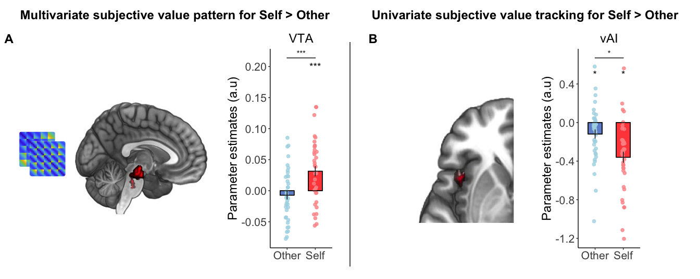
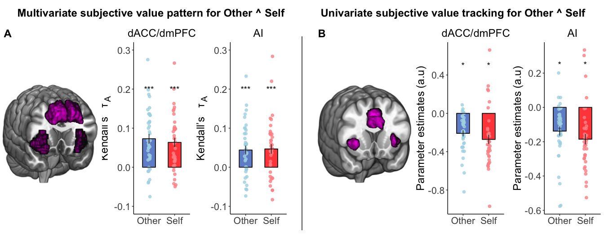
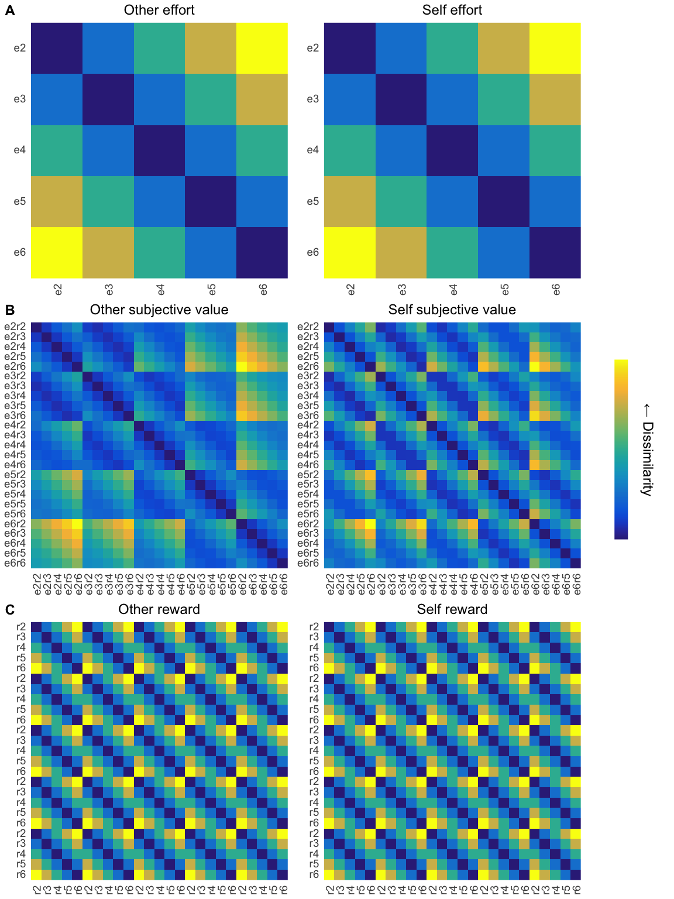
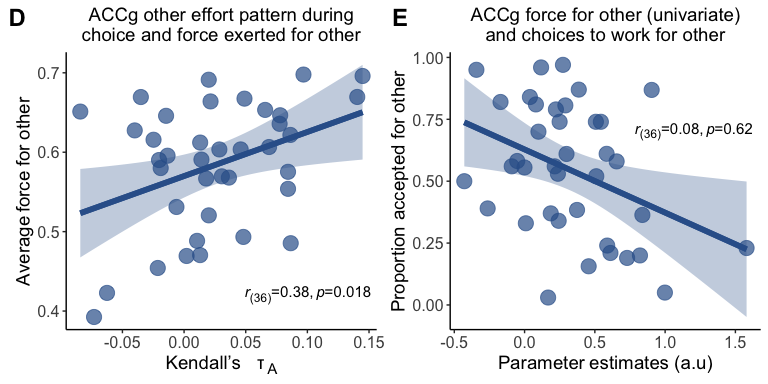
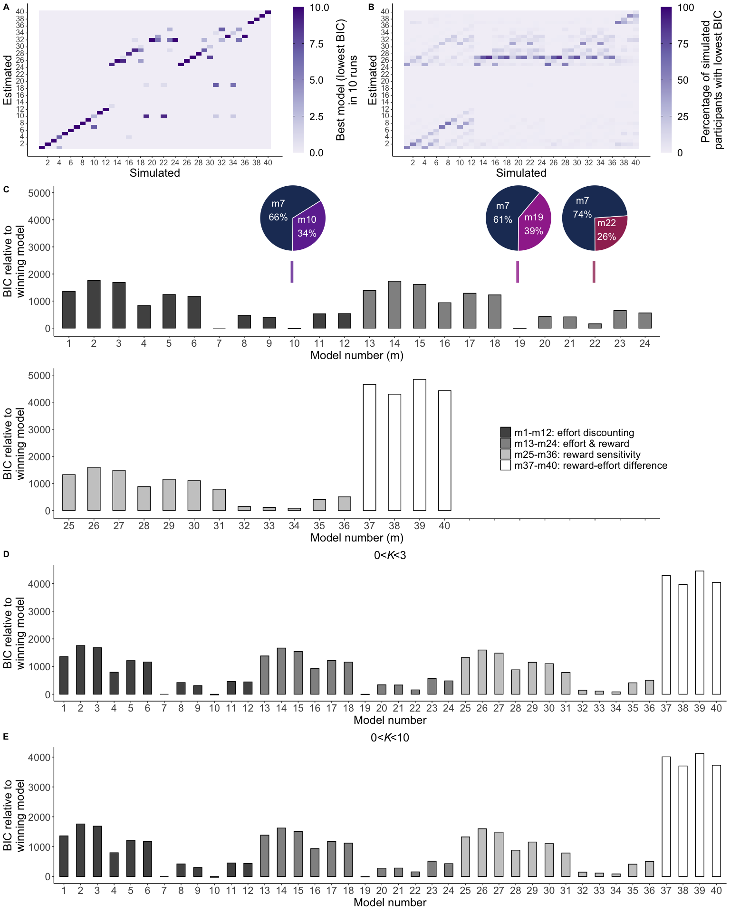
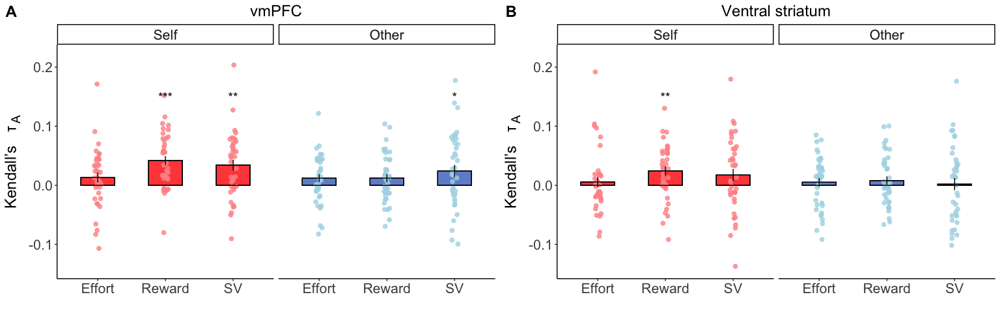

## Set up and functions

## Analyse choice data

## Analyse <i>Κ</i> parameters

## Analyse force data

## Analyse RT & time in window data

## Figure 2

<!-- -->

**Figure 2. Choices and computational modelling of prosocial and self-benefitting decisions.**

## Figure 3

<!-- -->
**Figure 3. Force exerted as a function of effort level and reward level for self and other.**

## RSA analysis

## Analyse QCAE

## Figure 4

<!-- -->

**Figure 4. ACCg codes patterns of effort for others only, varies with level of affective empathy, and tracks effort required to benefit others only.**

## Figure 5

<!-- -->
**Figure 5. Self-benefitting and domain general representations and tracking of subjective value.**

## Figure 6

<!-- -->

**Figure 6. Multivariate and univariate patterns and signals of subjective value overlap in dACC/dmPFC and AI.**

# Supplementary

## Figure S1

<!-- -->

**Figure S1. Model RDMs for effort, subjective value and reward. Related to Figure 1.**

### Figure S2

<!-- -->

### Figure S3

<!-- -->
**Figure S3. Model identifiability and model comparison with all models and different Κ bounds. Related to Figure 2. ** 

### Figure S5

<!-- -->

**Figure S5. vmPFC and VS multivariate patterns of effort, reward and subjective value. Related to Table S6.**

### Table 1

<table class="table" style="margin-left: auto; margin-right: auto;">
<caption>Summary statistics and Wilcoxon comparisons between self and other for behavioural variables</caption>
 <thead>
  <tr>
   <th style="text-align:left;"> measure </th>
   <th style="text-align:center;"> self_mean </th>
   <th style="text-align:center;"> self_se </th>
   <th style="text-align:center;"> other_mean </th>
   <th style="text-align:center;"> other_se </th>
   <th style="text-align:center;"> Z </th>
   <th style="text-align:center;"> effsize </th>
   <th style="text-align:center;"> conf.low </th>
   <th style="text-align:center;"> conf.high </th>
   <th style="text-align:center;"> p </th>
  </tr>
 </thead>
<tbody>
  <tr>
   <td style="text-align:left;"> Accept </td>
   <td style="text-align:center;"> 0.79 </td>
   <td style="text-align:center;"> 0.03 </td>
   <td style="text-align:center;"> 0.54 </td>
   <td style="text-align:center;"> 0.04 </td>
   <td style="text-align:center;"> -4.73 </td>
   <td style="text-align:center;"> 0.47 </td>
   <td style="text-align:center;"> 0.27 </td>
   <td style="text-align:center;"> 0.63 </td>
   <td style="text-align:center;"> &lt;0.001 </td>
  </tr>
  <tr>
   <td style="text-align:left;"> RT </td>
   <td style="text-align:center;"> 1.07 </td>
   <td style="text-align:center;"> 0.03 </td>
   <td style="text-align:center;"> 1.16 </td>
   <td style="text-align:center;"> 0.04 </td>
   <td style="text-align:center;"> -4.62 </td>
   <td style="text-align:center;"> 0.19 </td>
   <td style="text-align:center;"> 0.01 </td>
   <td style="text-align:center;"> 0.40 </td>
   <td style="text-align:center;"> &lt;0.001 </td>
  </tr>
  <tr>
   <td style="text-align:left;"> TiW </td>
   <td style="text-align:center;"> 1.86 </td>
   <td style="text-align:center;"> 0.03 </td>
   <td style="text-align:center;"> 1.86 </td>
   <td style="text-align:center;"> 0.03 </td>
   <td style="text-align:center;"> -0.62 </td>
   <td style="text-align:center;"> 0.01 </td>
   <td style="text-align:center;"> 0.00 </td>
   <td style="text-align:center;"> 0.27 </td>
   <td style="text-align:center;"> 0.54 </td>
  </tr>
  <tr>
   <td style="text-align:left;"> Success </td>
   <td style="text-align:center;"> 0.97 </td>
   <td style="text-align:center;"> 0.01 </td>
   <td style="text-align:center;"> 0.97 </td>
   <td style="text-align:center;"> 0.01 </td>
   <td style="text-align:center;"> -0.88 </td>
   <td style="text-align:center;"> 0.05 </td>
   <td style="text-align:center;"> 0.00 </td>
   <td style="text-align:center;"> 0.27 </td>
   <td style="text-align:center;"> 0.38 </td>
  </tr>
  <tr>
   <td style="text-align:left;"> Force </td>
   <td style="text-align:center;"> 0.64 </td>
   <td style="text-align:center;"> 0.01 </td>
   <td style="text-align:center;"> 0.58 </td>
   <td style="text-align:center;"> 0.01 </td>
   <td style="text-align:center;"> -4.77 </td>
   <td style="text-align:center;"> 0.35 </td>
   <td style="text-align:center;"> 0.13 </td>
   <td style="text-align:center;"> 0.53 </td>
   <td style="text-align:center;"> &lt;0.001 </td>
  </tr>
</tbody>
</table>

### Table S1

<table class="table" style="margin-left: auto; margin-right: auto;">
<caption>Generalised linear mixed-effects model predicting choices</caption>
 <thead>
  <tr>
   <th style="text-align:left;"> Parameter </th>
   <th style="text-align:center;"> Coefficient </th>
   <th style="text-align:center;"> SE </th>
   <th style="text-align:center;"> CI </th>
   <th style="text-align:center;"> CI_low </th>
   <th style="text-align:center;"> CI_high </th>
   <th style="text-align:center;"> z </th>
   <th style="text-align:center;"> Chisq </th>
   <th style="text-align:center;"> df </th>
   <th style="text-align:center;"> p </th>
   <th style="text-align:center;"> Group </th>
  </tr>
 </thead>
<tbody>
  <tr>
   <td style="text-align:left;"> (Intercept) </td>
   <td style="text-align:center;"> 6.98 </td>
   <td style="text-align:center;"> 2.52 </td>
   <td style="text-align:center;"> 0.95 </td>
   <td style="text-align:center;"> 3.44 </td>
   <td style="text-align:center;"> 14.15 </td>
   <td style="text-align:center;"> 5.39 </td>
   <td style="text-align:center;"> NA </td>
   <td style="text-align:center;"> NA </td>
   <td style="text-align:center;"> NA </td>
   <td style="text-align:center;">  </td>
  </tr>
  <tr>
   <td style="text-align:left;"> Recipient (Self vs. Other) </td>
   <td style="text-align:center;"> 4.04 </td>
   <td style="text-align:center;"> 0.99 </td>
   <td style="text-align:center;"> 0.95 </td>
   <td style="text-align:center;"> 2.49 </td>
   <td style="text-align:center;"> 6.54 </td>
   <td style="text-align:center;"> 5.66 </td>
   <td style="text-align:center;"> 23.05 </td>
   <td style="text-align:center;"> 1 </td>
   <td style="text-align:center;"> 0.001 </td>
   <td style="text-align:center;">  </td>
  </tr>
  <tr>
   <td style="text-align:left;"> Effort </td>
   <td style="text-align:center;"> 0.13 </td>
   <td style="text-align:center;"> 0.02 </td>
   <td style="text-align:center;"> 0.95 </td>
   <td style="text-align:center;"> 0.09 </td>
   <td style="text-align:center;"> 0.17 </td>
   <td style="text-align:center;"> -12.38 </td>
   <td style="text-align:center;"> 64.24 </td>
   <td style="text-align:center;"> 1 </td>
   <td style="text-align:center;"> 0.001 </td>
   <td style="text-align:center;">  </td>
  </tr>
  <tr>
   <td style="text-align:left;"> Reward </td>
   <td style="text-align:center;"> 6.10 </td>
   <td style="text-align:center;"> 1.18 </td>
   <td style="text-align:center;"> 0.95 </td>
   <td style="text-align:center;"> 4.18 </td>
   <td style="text-align:center;"> 8.90 </td>
   <td style="text-align:center;"> 9.38 </td>
   <td style="text-align:center;"> 46.05 </td>
   <td style="text-align:center;"> 1 </td>
   <td style="text-align:center;"> 0.001 </td>
   <td style="text-align:center;">  </td>
  </tr>
  <tr>
   <td style="text-align:left;"> Recipient (Self vs. Other) * Effort </td>
   <td style="text-align:center;"> 1.20 </td>
   <td style="text-align:center;"> 0.09 </td>
   <td style="text-align:center;"> 0.95 </td>
   <td style="text-align:center;"> 1.03 </td>
   <td style="text-align:center;"> 1.40 </td>
   <td style="text-align:center;"> 2.40 </td>
   <td style="text-align:center;"> 6.53 </td>
   <td style="text-align:center;"> 1 </td>
   <td style="text-align:center;"> 0.011 </td>
   <td style="text-align:center;">  </td>
  </tr>
  <tr>
   <td style="text-align:left;"> Recipient (Self vs. Other) * Reward </td>
   <td style="text-align:center;"> 1.31 </td>
   <td style="text-align:center;"> 0.11 </td>
   <td style="text-align:center;"> 0.95 </td>
   <td style="text-align:center;"> 1.11 </td>
   <td style="text-align:center;"> 1.55 </td>
   <td style="text-align:center;"> 3.20 </td>
   <td style="text-align:center;"> 9.51 </td>
   <td style="text-align:center;"> 1 </td>
   <td style="text-align:center;"> 0.003 </td>
   <td style="text-align:center;">  </td>
  </tr>
  <tr>
   <td style="text-align:left;"> Effort * Reward </td>
   <td style="text-align:center;"> 1.18 </td>
   <td style="text-align:center;"> 0.11 </td>
   <td style="text-align:center;"> 0.95 </td>
   <td style="text-align:center;"> 0.99 </td>
   <td style="text-align:center;"> 1.42 </td>
   <td style="text-align:center;"> 1.83 </td>
   <td style="text-align:center;"> 3.38 </td>
   <td style="text-align:center;"> 1 </td>
   <td style="text-align:center;"> 0.088 </td>
   <td style="text-align:center;">  </td>
  </tr>
  <tr>
   <td style="text-align:left;"> Recipient (Self vs. Other) * Effort * Reward </td>
   <td style="text-align:center;"> 0.97 </td>
   <td style="text-align:center;"> 0.05 </td>
   <td style="text-align:center;"> 0.95 </td>
   <td style="text-align:center;"> 0.87 </td>
   <td style="text-align:center;"> 1.09 </td>
   <td style="text-align:center;"> -0.47 </td>
   <td style="text-align:center;"> 0.19 </td>
   <td style="text-align:center;"> 1 </td>
   <td style="text-align:center;"> 0.67 </td>
   <td style="text-align:center;">  </td>
  </tr>
</tbody>
</table>

### Table S2

<table class="table" style="margin-left: auto; margin-right: auto;">
<caption>Linear mixed-effects model predicting normalised force</caption>
 <thead>
  <tr>
   <th style="text-align:left;"> Parameter </th>
   <th style="text-align:center;"> Chisq </th>
   <th style="text-align:center;"> df </th>
   <th style="text-align:center;"> p </th>
  </tr>
 </thead>
<tbody>
  <tr>
   <td style="text-align:left;"> Recipient (Self vs. Other) </td>
   <td style="text-align:center;"> 7.1 </td>
   <td style="text-align:center;"> 1 </td>
   <td style="text-align:center;"> 0.013 </td>
  </tr>
  <tr>
   <td style="text-align:left;"> Effort </td>
   <td style="text-align:center;"> 409.1 </td>
   <td style="text-align:center;"> 4 </td>
   <td style="text-align:center;"> 0.001 </td>
  </tr>
  <tr>
   <td style="text-align:left;"> Reward </td>
   <td style="text-align:center;"> 65.7 </td>
   <td style="text-align:center;"> 4 </td>
   <td style="text-align:center;"> 0.001 </td>
  </tr>
  <tr>
   <td style="text-align:left;"> Recipient (Self vs. Other) * Effort </td>
   <td style="text-align:center;"> 5.4 </td>
   <td style="text-align:center;"> 4 </td>
   <td style="text-align:center;"> 0.24 </td>
  </tr>
  <tr>
   <td style="text-align:left;"> Recipient (Self vs. Other) * Reward </td>
   <td style="text-align:center;"> 13.2 </td>
   <td style="text-align:center;"> 4 </td>
   <td style="text-align:center;"> 0.014 </td>
  </tr>
  <tr>
   <td style="text-align:left;"> Effort * Reward </td>
   <td style="text-align:center;"> 49.9 </td>
   <td style="text-align:center;"> 16 </td>
   <td style="text-align:center;"> 0.001 </td>
  </tr>
  <tr>
   <td style="text-align:left;"> Recipient (Self vs. Other) * Effort * Reward </td>
   <td style="text-align:center;"> 42.0 </td>
   <td style="text-align:center;"> 16 </td>
   <td style="text-align:center;"> 0.002 </td>
  </tr>
</tbody>
</table>
### Table S3

<table class="table" style="margin-left: auto; margin-right: auto;">
<caption>Kendall’s τA correlations between brain RDMs and model RDMs</caption>
 <thead>
  <tr>
   <th style="text-align:left;"> Recipient </th>
   <th style="text-align:left;"> Measure </th>
   <th style="text-align:left;"> Area </th>
   <th style="text-align:center;"> mean </th>
   <th style="text-align:center;"> sem </th>
   <th style="text-align:center;"> pval </th>
   <th style="text-align:center;"> pvalFDR </th>
  </tr>
 </thead>
<tbody>
  <tr>
   <td style="text-align:left;"> Other </td>
   <td style="text-align:left;"> effort RDM </td>
   <td style="text-align:left;"> vmPFC </td>
   <td style="text-align:center;"> 0.01 </td>
   <td style="text-align:center;"> 0.01 </td>
   <td style="text-align:center;"> 0.029 </td>
   <td style="text-align:center;"> 0.059 </td>
  </tr>
  <tr>
   <td style="text-align:left;"> Other </td>
   <td style="text-align:left;"> effort RDM </td>
   <td style="text-align:left;"> VS </td>
   <td style="text-align:center;"> 0.01 </td>
   <td style="text-align:center;"> 0.01 </td>
   <td style="text-align:center;"> 0.24 </td>
   <td style="text-align:center;"> 0.29 </td>
  </tr>
  <tr>
   <td style="text-align:left;"> Self </td>
   <td style="text-align:left;"> effort RDM </td>
   <td style="text-align:left;"> vmPFC </td>
   <td style="text-align:center;"> 0.01 </td>
   <td style="text-align:center;"> 0.01 </td>
   <td style="text-align:center;"> 0.030 </td>
   <td style="text-align:center;"> 0.059 </td>
  </tr>
  <tr>
   <td style="text-align:left;"> Self </td>
   <td style="text-align:left;"> effort RDM </td>
   <td style="text-align:left;"> VS </td>
   <td style="text-align:center;"> 0.01 </td>
   <td style="text-align:center;"> 0.01 </td>
   <td style="text-align:center;"> 0.61 </td>
   <td style="text-align:center;"> 0.61 </td>
  </tr>
  <tr>
   <td style="text-align:left;"> Other </td>
   <td style="text-align:left;"> reward RDM </td>
   <td style="text-align:left;"> vmPFC </td>
   <td style="text-align:center;"> 0.01 </td>
   <td style="text-align:center;"> 0.01 </td>
   <td style="text-align:center;"> 0.051 </td>
   <td style="text-align:center;"> 0.087 </td>
  </tr>
  <tr>
   <td style="text-align:left;"> Other </td>
   <td style="text-align:left;"> reward RDM </td>
   <td style="text-align:left;"> VS </td>
   <td style="text-align:center;"> 0.01 </td>
   <td style="text-align:center;"> 0.01 </td>
   <td style="text-align:center;"> 0.24 </td>
   <td style="text-align:center;"> 0.29 </td>
  </tr>
  <tr>
   <td style="text-align:left;"> Self </td>
   <td style="text-align:left;"> reward RDM </td>
   <td style="text-align:left;"> vmPFC </td>
   <td style="text-align:center;"> 0.04 </td>
   <td style="text-align:center;"> 0.01 </td>
   <td style="text-align:center;"> &lt;0.001 </td>
   <td style="text-align:center;"> &lt;0.001 </td>
  </tr>
  <tr>
   <td style="text-align:left;"> Self </td>
   <td style="text-align:left;"> reward RDM </td>
   <td style="text-align:left;"> VS </td>
   <td style="text-align:center;"> 0.02 </td>
   <td style="text-align:center;"> 0.01 </td>
   <td style="text-align:center;"> 0.001 </td>
   <td style="text-align:center;"> 0.005 </td>
  </tr>
  <tr>
   <td style="text-align:left;"> Other </td>
   <td style="text-align:left;"> subjective value RDM </td>
   <td style="text-align:left;"> vmPFC </td>
   <td style="text-align:center;"> 0.02 </td>
   <td style="text-align:center;"> 0.01 </td>
   <td style="text-align:center;"> 0.017 </td>
   <td style="text-align:center;"> 0.050 </td>
  </tr>
  <tr>
   <td style="text-align:left;"> Other </td>
   <td style="text-align:left;"> subjective value RDM </td>
   <td style="text-align:left;"> VS </td>
   <td style="text-align:center;"> 0.00 </td>
   <td style="text-align:center;"> 0.01 </td>
   <td style="text-align:center;"> 0.49 </td>
   <td style="text-align:center;"> 0.54 </td>
  </tr>
  <tr>
   <td style="text-align:left;"> Self </td>
   <td style="text-align:left;"> subjective value RDM </td>
   <td style="text-align:left;"> vmPFC </td>
   <td style="text-align:center;"> 0.03 </td>
   <td style="text-align:center;"> 0.01 </td>
   <td style="text-align:center;"> &lt;0.001 </td>
   <td style="text-align:center;"> 0.002 </td>
  </tr>
  <tr>
   <td style="text-align:left;"> Self </td>
   <td style="text-align:left;"> subjective value RDM </td>
   <td style="text-align:left;"> VS </td>
   <td style="text-align:center;"> 0.02 </td>
   <td style="text-align:center;"> 0.01 </td>
   <td style="text-align:center;"> 0.061 </td>
   <td style="text-align:center;"> 0.092 </td>
  </tr>
</tbody>
</table>

### Table S4

<table class="table" style="margin-left: auto; margin-right: auto;">
<caption>Contrasts between RDMs</caption>
 <thead>
  <tr>
   <th style="text-align:left;"> Contrast </th>
   <th style="text-align:left;"> Measure </th>
   <th style="text-align:left;"> Area </th>
   <th style="text-align:center;"> Z </th>
   <th style="text-align:center;"> effsize </th>
   <th style="text-align:center;"> conf.low </th>
   <th style="text-align:center;"> conf.high </th>
   <th style="text-align:center;"> pval </th>
  </tr>
 </thead>
<tbody>
  <tr>
   <td style="text-align:left;"> Reward vs. effort </td>
   <td style="text-align:left;"> self RDM </td>
   <td style="text-align:left;"> vmPFC </td>
   <td style="text-align:center;"> -2.28 </td>
   <td style="text-align:center;"> 0.37 </td>
   <td style="text-align:center;"> 0.06 </td>
   <td style="text-align:center;"> 0.62 </td>
   <td style="text-align:center;"> 0.023 </td>
  </tr>
  <tr>
   <td style="text-align:left;"> Reward vs. effort </td>
   <td style="text-align:left;"> self RDM </td>
   <td style="text-align:left;"> VS </td>
   <td style="text-align:center;"> -1.49 </td>
   <td style="text-align:center;"> 0.24 </td>
   <td style="text-align:center;"> 0.01 </td>
   <td style="text-align:center;"> 0.53 </td>
   <td style="text-align:center;"> 0.14 </td>
  </tr>
  <tr>
   <td style="text-align:left;"> Reward vs. effort </td>
   <td style="text-align:left;"> other RDM </td>
   <td style="text-align:left;"> vmPFC </td>
   <td style="text-align:center;"> -0.50 </td>
   <td style="text-align:center;"> 0.08 </td>
   <td style="text-align:center;"> 0.01 </td>
   <td style="text-align:center;"> 0.41 </td>
   <td style="text-align:center;"> 0.62 </td>
  </tr>
  <tr>
   <td style="text-align:left;"> Reward vs. effort </td>
   <td style="text-align:left;"> other RDM </td>
   <td style="text-align:left;"> VS </td>
   <td style="text-align:center;"> -0.17 </td>
   <td style="text-align:center;"> 0.03 </td>
   <td style="text-align:center;"> 0.01 </td>
   <td style="text-align:center;"> 0.38 </td>
   <td style="text-align:center;"> 0.86 </td>
  </tr>
</tbody>
</table>

### Table S5

<table class="table" style="margin-left: auto; margin-right: auto;">
<caption>Kendall’s τA correlations between brain RDMs and model RDMs</caption>
 <thead>
  <tr>
   <th style="text-align:left;"> Recipient </th>
   <th style="text-align:left;"> Measure </th>
   <th style="text-align:left;"> Area </th>
   <th style="text-align:center;"> mean </th>
   <th style="text-align:center;"> sem </th>
   <th style="text-align:center;"> pval </th>
   <th style="text-align:center;"> pvalFDR </th>
  </tr>
 </thead>
<tbody>
  <tr>
   <td style="text-align:left;"> Other </td>
   <td style="text-align:left;"> effort RDM </td>
   <td style="text-align:left;"> ACCg </td>
   <td style="text-align:center;"> 0.03 </td>
   <td style="text-align:center;"> 0.01 </td>
   <td style="text-align:center;"> 0.005 </td>
   <td style="text-align:center;"> 0.009 </td>
  </tr>
  <tr>
   <td style="text-align:left;"> Other </td>
   <td style="text-align:left;"> effort RDM </td>
   <td style="text-align:left;"> AI </td>
   <td style="text-align:center;"> 0.02 </td>
   <td style="text-align:center;"> 0.01 </td>
   <td style="text-align:center;"> 0.006 </td>
   <td style="text-align:center;"> 0.009 </td>
  </tr>
  <tr>
   <td style="text-align:left;"> Other </td>
   <td style="text-align:left;"> effort RDM </td>
   <td style="text-align:left;"> dACC </td>
   <td style="text-align:center;"> 0.03 </td>
   <td style="text-align:center;"> 0.01 </td>
   <td style="text-align:center;"> 0.001 </td>
   <td style="text-align:center;"> 0.003 </td>
  </tr>
  <tr>
   <td style="text-align:left;"> Other </td>
   <td style="text-align:left;"> effort RDM </td>
   <td style="text-align:left;"> TPJ </td>
   <td style="text-align:center;"> 0.03 </td>
   <td style="text-align:center;"> 0.01 </td>
   <td style="text-align:center;"> 0.001 </td>
   <td style="text-align:center;"> 0.003 </td>
  </tr>
  <tr>
   <td style="text-align:left;"> Self </td>
   <td style="text-align:left;"> effort RDM </td>
   <td style="text-align:left;"> ACCg </td>
   <td style="text-align:center;"> 0.00 </td>
   <td style="text-align:center;"> 0.01 </td>
   <td style="text-align:center;"> 0.61 </td>
   <td style="text-align:center;"> 0.61 </td>
  </tr>
  <tr>
   <td style="text-align:left;"> Self </td>
   <td style="text-align:left;"> effort RDM </td>
   <td style="text-align:left;"> AI </td>
   <td style="text-align:center;"> 0.01 </td>
   <td style="text-align:center;"> 0.01 </td>
   <td style="text-align:center;"> 0.40 </td>
   <td style="text-align:center;"> 0.42 </td>
  </tr>
  <tr>
   <td style="text-align:left;"> Self </td>
   <td style="text-align:left;"> effort RDM </td>
   <td style="text-align:left;"> dACC </td>
   <td style="text-align:center;"> 0.02 </td>
   <td style="text-align:center;"> 0.01 </td>
   <td style="text-align:center;"> 0.16 </td>
   <td style="text-align:center;"> 0.17 </td>
  </tr>
  <tr>
   <td style="text-align:left;"> Self </td>
   <td style="text-align:left;"> effort RDM </td>
   <td style="text-align:left;"> TPJ </td>
   <td style="text-align:center;"> 0.02 </td>
   <td style="text-align:center;"> 0.01 </td>
   <td style="text-align:center;"> 0.026 </td>
   <td style="text-align:center;"> 0.032 </td>
  </tr>
  <tr>
   <td style="text-align:left;"> Other </td>
   <td style="text-align:left;"> reward RDM </td>
   <td style="text-align:left;"> ACCg </td>
   <td style="text-align:center;"> 0.01 </td>
   <td style="text-align:center;"> 0.01 </td>
   <td style="text-align:center;"> 0.16 </td>
   <td style="text-align:center;"> 0.17 </td>
  </tr>
  <tr>
   <td style="text-align:left;"> Other </td>
   <td style="text-align:left;"> reward RDM </td>
   <td style="text-align:left;"> AI </td>
   <td style="text-align:center;"> 0.02 </td>
   <td style="text-align:center;"> 0.01 </td>
   <td style="text-align:center;"> 0.006 </td>
   <td style="text-align:center;"> 0.009 </td>
  </tr>
  <tr>
   <td style="text-align:left;"> Other </td>
   <td style="text-align:left;"> reward RDM </td>
   <td style="text-align:left;"> dACC </td>
   <td style="text-align:center;"> 0.03 </td>
   <td style="text-align:center;"> 0.01 </td>
   <td style="text-align:center;"> 0.001 </td>
   <td style="text-align:center;"> 0.003 </td>
  </tr>
  <tr>
   <td style="text-align:left;"> Other </td>
   <td style="text-align:left;"> reward RDM </td>
   <td style="text-align:left;"> TPJ </td>
   <td style="text-align:center;"> 0.02 </td>
   <td style="text-align:center;"> 0.01 </td>
   <td style="text-align:center;"> 0.027 </td>
   <td style="text-align:center;"> 0.033 </td>
  </tr>
  <tr>
   <td style="text-align:left;"> Self </td>
   <td style="text-align:left;"> reward RDM </td>
   <td style="text-align:left;"> ACCg </td>
   <td style="text-align:center;"> 0.04 </td>
   <td style="text-align:center;"> 0.01 </td>
   <td style="text-align:center;"> &lt;0.001 </td>
   <td style="text-align:center;"> &lt;0.001 </td>
  </tr>
  <tr>
   <td style="text-align:left;"> Self </td>
   <td style="text-align:left;"> reward RDM </td>
   <td style="text-align:left;"> AI </td>
   <td style="text-align:center;"> 0.03 </td>
   <td style="text-align:center;"> 0.01 </td>
   <td style="text-align:center;"> &lt;0.001 </td>
   <td style="text-align:center;"> 0.002 </td>
  </tr>
  <tr>
   <td style="text-align:left;"> Self </td>
   <td style="text-align:left;"> reward RDM </td>
   <td style="text-align:left;"> dACC </td>
   <td style="text-align:center;"> 0.04 </td>
   <td style="text-align:center;"> 0.01 </td>
   <td style="text-align:center;"> &lt;0.001 </td>
   <td style="text-align:center;"> &lt;0.001 </td>
  </tr>
  <tr>
   <td style="text-align:left;"> Self </td>
   <td style="text-align:left;"> reward RDM </td>
   <td style="text-align:left;"> TPJ </td>
   <td style="text-align:center;"> 0.03 </td>
   <td style="text-align:center;"> 0.01 </td>
   <td style="text-align:center;"> 0.005 </td>
   <td style="text-align:center;"> 0.008 </td>
  </tr>
  <tr>
   <td style="text-align:left;"> Other </td>
   <td style="text-align:left;"> subjective value RDM </td>
   <td style="text-align:left;"> ACCg </td>
   <td style="text-align:center;"> 0.04 </td>
   <td style="text-align:center;"> 0.01 </td>
   <td style="text-align:center;"> 0.009 </td>
   <td style="text-align:center;"> 0.013 </td>
  </tr>
  <tr>
   <td style="text-align:left;"> Other </td>
   <td style="text-align:left;"> subjective value RDM </td>
   <td style="text-align:left;"> AI </td>
   <td style="text-align:center;"> 0.05 </td>
   <td style="text-align:center;"> 0.01 </td>
   <td style="text-align:center;"> &lt;0.001 </td>
   <td style="text-align:center;"> &lt;0.001 </td>
  </tr>
  <tr>
   <td style="text-align:left;"> Other </td>
   <td style="text-align:left;"> subjective value RDM </td>
   <td style="text-align:left;"> dACC </td>
   <td style="text-align:center;"> 0.07 </td>
   <td style="text-align:center;"> 0.01 </td>
   <td style="text-align:center;"> &lt;0.001 </td>
   <td style="text-align:center;"> &lt;0.001 </td>
  </tr>
  <tr>
   <td style="text-align:left;"> Other </td>
   <td style="text-align:left;"> subjective value RDM </td>
   <td style="text-align:left;"> TPJ </td>
   <td style="text-align:center;"> 0.04 </td>
   <td style="text-align:center;"> 0.01 </td>
   <td style="text-align:center;"> &lt;0.001 </td>
   <td style="text-align:center;"> &lt;0.001 </td>
  </tr>
  <tr>
   <td style="text-align:left;"> Self </td>
   <td style="text-align:left;"> subjective value RDM </td>
   <td style="text-align:left;"> ACCg </td>
   <td style="text-align:center;"> 0.05 </td>
   <td style="text-align:center;"> 0.01 </td>
   <td style="text-align:center;"> &lt;0.001 </td>
   <td style="text-align:center;"> &lt;0.001 </td>
  </tr>
  <tr>
   <td style="text-align:left;"> Self </td>
   <td style="text-align:left;"> subjective value RDM </td>
   <td style="text-align:left;"> AI </td>
   <td style="text-align:center;"> 0.05 </td>
   <td style="text-align:center;"> 0.01 </td>
   <td style="text-align:center;"> &lt;0.001 </td>
   <td style="text-align:center;"> &lt;0.001 </td>
  </tr>
  <tr>
   <td style="text-align:left;"> Self </td>
   <td style="text-align:left;"> subjective value RDM </td>
   <td style="text-align:left;"> dACC </td>
   <td style="text-align:center;"> 0.06 </td>
   <td style="text-align:center;"> 0.01 </td>
   <td style="text-align:center;"> &lt;0.001 </td>
   <td style="text-align:center;"> &lt;0.001 </td>
  </tr>
  <tr>
   <td style="text-align:left;"> Self </td>
   <td style="text-align:left;"> subjective value RDM </td>
   <td style="text-align:left;"> TPJ </td>
   <td style="text-align:center;"> 0.03 </td>
   <td style="text-align:center;"> 0.01 </td>
   <td style="text-align:center;"> 0.018 </td>
   <td style="text-align:center;"> 0.024 </td>
  </tr>
</tbody>
</table>
