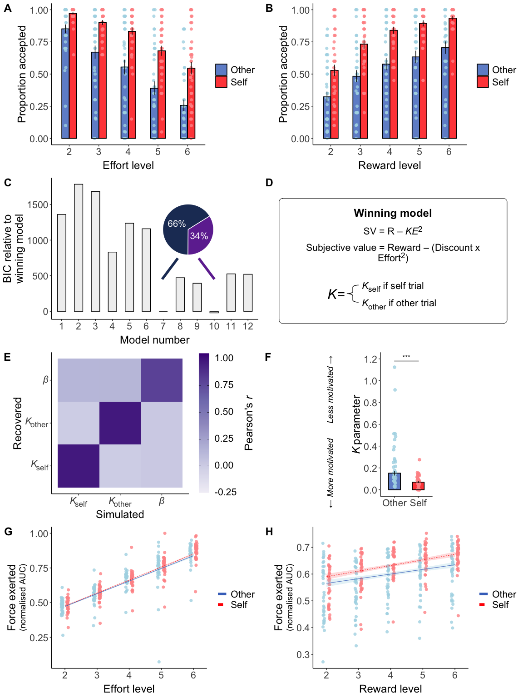
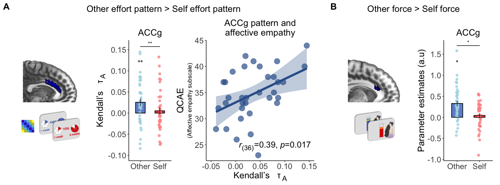
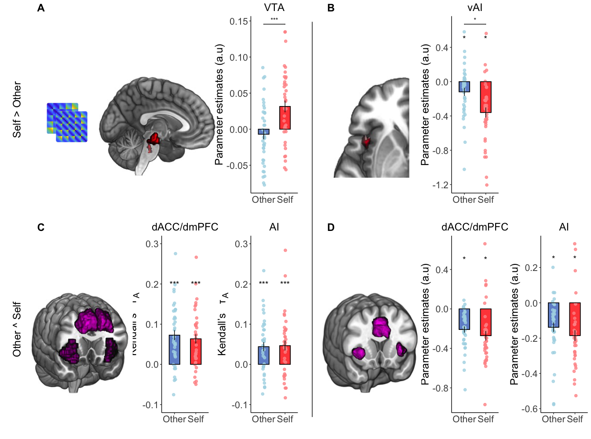
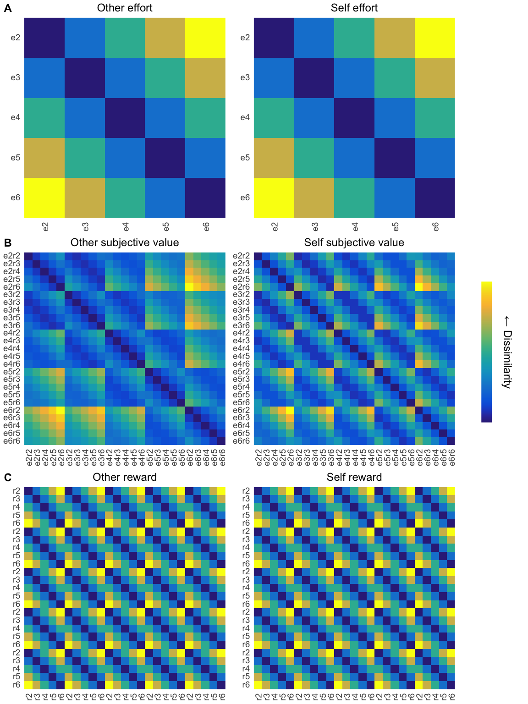
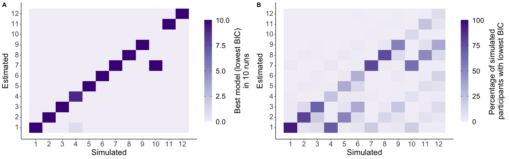

## Set up and functions

## Analyse choice data

We observed a significant
recipient\*effort\*reward interaction (odds ratio
(OR)=0.90,
95% confidence
interval=[0.83,
0.97],
*p*=0.009), 
showing that people were less willing to help others at higher effort and lower reward levels.
We also observed significant interactions between recipient and reward
(OR=1.31
[1.20,
1.43],
*p*=0.001),
effort and reward
(OR=1.10
[1.02,
1.20],
*p*=0.001), and
main effects of recipient, effort, and reward (Figures 2a-b, S3 and Table S1).

## Analyse <i>Κ</i> parameters

This analysis showed that discount values for other were significantly
higher for other (<i>Κ</i>other
median=0.15) than for self
(<i>Κ</i>self
median=0.07, 
Wilcoxon two-sided signed rank test Z=-5.34, 
effect size *r*=0.50,
[0.31,
0.66],
*p*<0.001, Figure 2f).

## Analyse force data

We observed a significant 3-way interaction between effort, reward, and recipient
(<i>χ</i>2(16)=39.02,
*p*=0.002).
We also found significant interactions between recipient and reward
(<i>χ</i>2(4)=12.49,
*p*=0.022),
effort and reward
(<i>χ</i>2(16)=47.78,
*p*=0.001), and
main effects of recipient, effort, and reward (all <i>χ</i>2s>24.74,
all *p*s<0.001; Figure 2g-h and Table S2).
Importantly, there was no significant difference in success between self
(mean=0.98)
and other trials
(mean=0.98,
Wilcoxon two-sided signed rank test Z=-0.59, 
effect size *r*=0.04,
[0.00,
0.27],
*p*=0.55) and Bayesian evidence for no
difference (BF01=4.35, substantial evidence in support of the
null).

## Figure 2

<!-- -->

**Figure 2. Choice, force, and computational modelling of prosocial and
self-benefitting decisions. (A)** Participants were less willing to
accept the work offer over the rest offer as the effort level increased (GLMM odds ratio for effort 
(OR)=0.23,
95% confidence interval=[0.21,
0.25],
*p*=0.001).
**(B)** The proportion of work offers
accepted over the baseline option increased as reward increased 
(reward OR=3.32 
[3.04,
3.64],
*p*=0.001).
Across effort and reward levels, participants were less willing to work when the other person would
benefit than when they would benefit 
(recipient OR=3.06 
[2.79,
3.35],
*p*=0.001). 
This tendency to work more for self than others was most pronounced at the higher reward levels 
(recipient\*reward OR=1.31 
[1.20, 
1.43],
*p*=0.001)
and particularly when a high level of effort was required 
(recipient\*effort\*reward OR=0.90 
[0.83, 
0.97],
*p*=0.009). 
Data are represented as mean ± SE. 
**(C)** We compared a range of computational
models and effort discounting that varied in terms of whether the model
had a single or separate discount (<i>Κ</i>) parameter(s) for Self and Other trials (models 1-6 vs. models 7-12) and whether the shape of the discount function was parabolic (models 1, 4, 7,10) linear (models 2, 5, 8, 11) or hyperbolic (models 3, 6, 9, 12). Models 7 and 10 had the lowest Bayesian Information Criterion (BIC) scores. These were both parabolic and had separate <i>Κ</i> parameters for self and other. However, model 7 that contained a single choice stochasticity parameter (<i>β</i>) explained behaviour in the majority of participants and was selected as the winning model. Bars show model BIC, proportions show the number of participants with the lowest BIC. 
**(D)** Equation for the winning parabolic model with separate discount (<i>Κ</i>) parameters 
and a single choice stochasticity (<i>β</i>) parameter that
explained behaviour in the majority of participants. **(E)** Parameter
recovery using simulated data from the winning model and choice
schedule showed excellent recovery of the model parameters. **(F)**
Statistical comparison of the <i>Κ</i> parameters from the best fitting model
showed that participants had a lower <i>Κ</i> parameter for self-benefitting
compared to prosocial choices (Wilcoxon two-sided signed rank test 
Z=-5.34,
*r*(38)=0.50,
[0.31,
0.66],
*p*<0.001). 
Data are represented as median ± SE, *** shows p<0.001 in Wilcoxon two-sided signed rank test. 
**(G)** Force exerted (normalised areas under the curve during the effort period) for
each of the levels of effort. Participants exerted less force for others overall
(LMM effect of recipient <i>χ</i>2(1)=
24.74,
*p*=0.001) and 
there was a 3-way interaction between recipient, effort and reward. 
**(H)** Force exerted for each reward level shows participants
exerted more force for higher rewards
(reward <i>χ</i>2(4)=
66.80,
*p*=0.001)
but this effect was reduced when the other person would benefit
(recipient\*reward <i>χ</i>2(4)=
12.49,
*p*=0.022).

## RSA analysis

Multivariate patterns in all of our four ROIs showed significant
correlations with the other-effort RDM when making prosocial choices
(other-effort mean rank correlation τA ± SE: ACCg
=
0.026
±
0.009,
*p*=0.005;
TPJ =
0.033
±
0.010,
*p*=0.001;
AI =
0.021
±
0.008,
*p*=0.006;
dACC/dmPFC =
0.029
±
0.008,
*p*=0.001,
surviving FDR correction for 24 comparisons (6 models, 4 brain areas, 2
recipients)). In contrast for self-effort patterns, only the TPJ brain
RDM significantly correlated with the effort model RDM (self-effort mean
rank correlation τA ± SE: ACCg =
0.002
±
0.009,
*p*=0.61;
TPJ =
0.024
±
0.010,
*p*=0.026;
AI =
0.008
±
0.009,
*p*=0.40;
dACC/dmPFC =
0.016
±
0.010,
*p*=0.16).
Critically, although TPJ, AI and dACC/dmPFC also represented prosocial
effort, they did not do so more strongly than for the self-effort RDMs
(Wilcoxon two-sided signed rank test, all
*p*s\>0.07).
In contrast, the ACCg ROI carried a multivariate representation of
effort on prosocial trials only, being the only ROI to display a
significant difference between the other-effort and self-effort RDMs
(Wilcoxon two-sided signed rank test
Z=-2.73,
*r*(38)=0.44,
[0.13,
0.69],
*p*=0.006,
Figure 3a). Notably the specificity for others effort was not due to
overall activation differences for other and self representations, as
ACCg was the only ROI that represented other and self offers as equally
dissimilar (see Methods, Bayesian paired sample t-test BF01=4.61,
substantial evidence in support of the null). Moreover, whilst patterns
in several regions significantly correlated with the other-reward RDM
(other-reward mean rank correlation τA ± SE: ACCg
=
0.009
±
0.007,
*p*=0.16;
TPJ =
0.016
±
0.007,
*p*=0.027;
AI =
0.020
±
0.008,
*p*=0.006;
dACC/dmPFC =
0.025
±
0.007,
*p*=0.001),
no region significantly represented others' rewards more strongly than
self-rewards (Table S3). Thus, multivariate patterns in
the ACCg represented effort costs specifically when making prosocial but
not self-benefitting choices (see Table S4 for exploratory whole-brain
searchlight results).

  

None of our ROIs showed a significantly
stronger correlation of the self-effort than other-effort RDM, nor for
the self-SV rather than other-SV RDM (all zvals= \<1.37 \|\| \>1.56, all
p's\>0.12, see Table S3 for reward RDM results).

  

We found significant correlations between the self-SV and other-SV RDMs
in both the dACC/dmPFC and AI (self-SV mean rank correlation
τA ± SE: dACC/dmPFC =
0.063
±
0.012,
*p*<0.001;
AI =
0.047 ±
0.012,
*p*<0.001;
other-SV mean rank correlation τA ± SE: dACC/dmPFC
=
0.073
±
0.012,
*p*<0.001;
AI =
0.051
±
0.013,
*p*<0.001;
all survive FDR correction, Figure 4c). 

   

Outside of dACC/dmPFC
and AI, we found multivariate patterns of subjective value that
overlapped between self and other in TPJ and ACCg self-SV mean rank
correlation τA ± SE: TPJ =
0.026
±
0.011,
*p*=0.018;
ACCg =
0.055
±
0.012,
*p*<0.001;
other-SV mean rank correlation τA ± SE: TPJ =
0.044
±
0.011,
*p*<0.001;
ACCg =
0.038
±
0.014,
*p*=0.009;
all survive FDR correction).

## Analyse QCAE

We found that affective empathy was positively correlated with the
strength of prosocial effort patterns in ACCg
(Pearson's *r*(38)=
0.39,
*p*=0.017) whilst cognitive empathy was
not (Pearson's *r*(38)=
0.05,
*p*=0.78, correlations significantly
different
*t*=2.04,
*p*=0.02). For
the tracking of prosocial effort in ACCg during force exerted, neither
affective or cognitive empathy were significantly correlated (all *r*s\>
-0.18,
all
*p*s\>0.29).

## Figure 3

<!-- -->

**Figure 3. ACCg codes patterns of effort for others only, varies with
level of affective empathy, and tracks force required to benefit others
only. (A)** Across an independent structural ROI of the anterior
cingulate gyrus (Neubert et al., 2014), representational dissimilarity
patterns of effort were encoded specifically for others. Kendall's
τA shows a greater correlation between brain RDM
and effort RDM during the offer period for other than self (Wilcoxon
two-sided signed rank test
Z=-2.73,
*r*(38)=0.44,
[0.13,
0.69],
*p*=0.006.
ROI displayed on an anatomical scan of the medial surface. Variability
in ACCg effort patterns for others was explained by individual
difference in affective empathy, as measured by the Questionnaire for
Cognitive and Affective Empathy (QCAE; Reniers et al., 2011). In contrast,
there was no significant correlation with cognitive empathy and the two
corelations were significantly different from one another (*t*=2.04,
*p*=0.024). **(B)** A cluster in the ACCg tracked with the amount of force
required during the force period specifically when making prosocial but
not self-benefitting decisions (x=-6, y=24, z=20, Z=3.28, k=41,
*p*\<0.05, FWE-SVC). Activation overlaid on an anatomical scan of the
medial surface. \**p*\<0.05, \*\**p*\<0.01 \*\*\**p*\<0.001.

## Figure 4

<!-- -->

**Figure 4. Self-benefitting and domain general representations and
tracking of subjective value. (A)** A cluster putatively in the ventral
tegmental area (VTA) encoded representational patterns of subjective value
exclusively on self-benefitting trials (x=4, y =-22, z=16, k=291,
Z=4.45, *p*=0.033 FWE-whole brain corrected after thresholding at
*p*\<0.001, Figure 4a, Table S4). **(B)** A sub-region of the ventral
anterior insula (vAI; x=-44 y=10 z=-10, Z=3.72, k=59, *p*\<0.05
FWE-small volume) tracked subjective value of the chosen offer
trial-by-trial more strongly for self-benefitting than other-benefitting
choices. **(C)** The dACC/dmPFC and AI showed significant correlations
between the brain-RDM and subjective value RDM pattern for both other
and self offers, consistent with a domain general response in these
regions (dACC/dmPFC: τA = 0.064 ± 0.017,
*p*\<0.001; AI: τA = 0.047 ± 0.012, *p*\<0.001).
**(D)** Univariate analysis also showed trial-by-trial tracking of
subjective value in dACC/dmPFC and AI for both self and other (x=8 y=26 
z=34, Z=4.75, k=1033, *p*\<0.05 FWE-whole brain) and bilateral
anterior insula (left: x=-28 y=22 z=6, Z=4.47, k=306, *p*\<0.001
FWE-SVC; right: x=34, y=24, z=2, Z=4.38, k=222, *p*\<0.05 FWE-small
volume). \**p*\<0.05, \*\**p*\<0.01 \*\*\**p*\<0.001.

# Supplementary

## Figure S2

<!-- -->

**Figure S2. RDMs for effort, subjective value and reward** 
Six 25 x 25 (5 effort and 5 reward levels) model representational dissimilarity matrices (RDMs) were constructed at the offer stage to analyse activity during effort-based decisions separately for the self and other conditions. These coded for different task features in multivariate space. **(A)** For the effort model RDMs, this was the Euclidean distance between effort levels on offer. **(B)** For the subjective value RDMs, this was the Euclidean distance between subjective values of offers based on the winning computational model with separate discount parameters (<i>Κ</i>) for self and other trials. Each participant’s individual <i>Κ</i> parameter was used. **(C)** For the reward RDMs this was the Euclidean distance between reward levels on offer. Yellow colours show conditions are more dissimilar whereas dark blue colours show conditions are more similar in terms of the Euclidean distance between conditions. 

### Figure S4

<!-- -->

**Figure S4. Model identifiability.** Data simulated from each of the 12 models for 100 participants shows that the model comparison procedure identifies the model that simulated the data, demonstrated by the strong diagonal. **(A)** We repeated the simulations and fittings ten times and quantified the winning model as with the modelling of participants’ data as the model with the lowest Bayesian Information Criterion (BIC), summing the number of times that model won across the ten runs. **(B)** We also calculated the percentage of simulated participants for which each model had the best fit to the data and averaged this over the ten runs.

### Table S1

<table class="table" style="margin-left: auto; margin-right: auto;">
<caption>Generalised linear mixed-effects model predicting choices</caption>
 <thead>
  <tr>
   <th style="text-align:left;"> Parameter </th>
   <th style="text-align:center;"> Coefficient </th>
   <th style="text-align:center;"> SE </th>
   <th style="text-align:center;"> CI </th>
   <th style="text-align:center;"> CI_low </th>
   <th style="text-align:center;"> CI_high </th>
   <th style="text-align:center;"> z </th>
   <th style="text-align:center;"> Chisq </th>
   <th style="text-align:center;"> df </th>
   <th style="text-align:center;"> p </th>
  </tr>
 </thead>
<tbody>
  <tr>
   <td style="text-align:left;"> (Intercept) </td>
   <td style="text-align:center;"> 4.23 </td>
   <td style="text-align:center;"> 1.12 </td>
   <td style="text-align:center;"> 0.95 </td>
   <td style="text-align:center;"> 2.52 </td>
   <td style="text-align:center;"> 7.10 </td>
   <td style="text-align:center;"> 5.46 </td>
   <td style="text-align:center;"> NA </td>
   <td style="text-align:center;"> NA </td>
   <td style="text-align:center;"> NA </td>
  </tr>
  <tr>
   <td style="text-align:left;"> Recipient (Self vs. Other) </td>
   <td style="text-align:center;"> 3.06 </td>
   <td style="text-align:center;"> 0.14 </td>
   <td style="text-align:center;"> 0.95 </td>
   <td style="text-align:center;"> 2.79 </td>
   <td style="text-align:center;"> 3.35 </td>
   <td style="text-align:center;"> 23.92 </td>
   <td style="text-align:center;"> 864.24 </td>
   <td style="text-align:center;"> 1 </td>
   <td style="text-align:center;"> 0.001 </td>
  </tr>
  <tr>
   <td style="text-align:left;"> Effort </td>
   <td style="text-align:center;"> 0.23 </td>
   <td style="text-align:center;"> 0.01 </td>
   <td style="text-align:center;"> 0.95 </td>
   <td style="text-align:center;"> 0.21 </td>
   <td style="text-align:center;"> 0.25 </td>
   <td style="text-align:center;"> -32.08 </td>
   <td style="text-align:center;"> 1702.03 </td>
   <td style="text-align:center;"> 1 </td>
   <td style="text-align:center;"> 0.001 </td>
  </tr>
  <tr>
   <td style="text-align:left;"> Reward </td>
   <td style="text-align:center;"> 3.32 </td>
   <td style="text-align:center;"> 0.15 </td>
   <td style="text-align:center;"> 0.95 </td>
   <td style="text-align:center;"> 3.04 </td>
   <td style="text-align:center;"> 3.64 </td>
   <td style="text-align:center;"> 26.06 </td>
   <td style="text-align:center;"> 1035.33 </td>
   <td style="text-align:center;"> 1 </td>
   <td style="text-align:center;"> 0.001 </td>
  </tr>
  <tr>
   <td style="text-align:left;"> Recipient (Self vs. Other) * Effort </td>
   <td style="text-align:center;"> 0.96 </td>
   <td style="text-align:center;"> 0.04 </td>
   <td style="text-align:center;"> 0.95 </td>
   <td style="text-align:center;"> 0.89 </td>
   <td style="text-align:center;"> 1.05 </td>
   <td style="text-align:center;"> -0.86 </td>
   <td style="text-align:center;"> 0.05 </td>
   <td style="text-align:center;"> 1 </td>
   <td style="text-align:center;"> 0.85 </td>
  </tr>
  <tr>
   <td style="text-align:left;"> Recipient (Self vs. Other) * Reward </td>
   <td style="text-align:center;"> 1.31 </td>
   <td style="text-align:center;"> 0.06 </td>
   <td style="text-align:center;"> 0.95 </td>
   <td style="text-align:center;"> 1.20 </td>
   <td style="text-align:center;"> 1.43 </td>
   <td style="text-align:center;"> 6.07 </td>
   <td style="text-align:center;"> 33.64 </td>
   <td style="text-align:center;"> 1 </td>
   <td style="text-align:center;"> 0.001 </td>
  </tr>
  <tr>
   <td style="text-align:left;"> Effort * Reward </td>
   <td style="text-align:center;"> 1.10 </td>
   <td style="text-align:center;"> 0.05 </td>
   <td style="text-align:center;"> 0.95 </td>
   <td style="text-align:center;"> 1.02 </td>
   <td style="text-align:center;"> 1.20 </td>
   <td style="text-align:center;"> 2.35 </td>
   <td style="text-align:center;"> 10.38 </td>
   <td style="text-align:center;"> 1 </td>
   <td style="text-align:center;"> 0.001 </td>
  </tr>
  <tr>
   <td style="text-align:left;"> Recipient (Self vs. Other) * Effort * Reward </td>
   <td style="text-align:center;"> 0.90 </td>
   <td style="text-align:center;"> 0.04 </td>
   <td style="text-align:center;"> 0.95 </td>
   <td style="text-align:center;"> 0.83 </td>
   <td style="text-align:center;"> 0.97 </td>
   <td style="text-align:center;"> -2.63 </td>
   <td style="text-align:center;"> 6.95 </td>
   <td style="text-align:center;"> 1 </td>
   <td style="text-align:center;"> 0.009 </td>
  </tr>
</tbody>
</table>

### Table S2

<table class="table" style="margin-left: auto; margin-right: auto;">
<caption>Linear mixed-effects model predicting normalised force</caption>
 <thead>
  <tr>
   <th style="text-align:left;"> Parameter </th>
   <th style="text-align:center;"> Chisq </th>
   <th style="text-align:center;"> df </th>
   <th style="text-align:center;"> p </th>
  </tr>
 </thead>
<tbody>
  <tr>
   <td style="text-align:left;"> Recipient (Self vs. Other) </td>
   <td style="text-align:center;"> 24.7 </td>
   <td style="text-align:center;"> 1 </td>
   <td style="text-align:center;"> 0.001 </td>
  </tr>
  <tr>
   <td style="text-align:left;"> Effort </td>
   <td style="text-align:center;"> 6995.3 </td>
   <td style="text-align:center;"> 4 </td>
   <td style="text-align:center;"> 0.001 </td>
  </tr>
  <tr>
   <td style="text-align:left;"> Reward </td>
   <td style="text-align:center;"> 66.8 </td>
   <td style="text-align:center;"> 4 </td>
   <td style="text-align:center;"> 0.001 </td>
  </tr>
  <tr>
   <td style="text-align:left;"> Recipient (Self vs. Other) * Effort </td>
   <td style="text-align:center;"> 7.9 </td>
   <td style="text-align:center;"> 4 </td>
   <td style="text-align:center;"> 0.11 </td>
  </tr>
  <tr>
   <td style="text-align:left;"> Recipient (Self vs. Other) * Reward </td>
   <td style="text-align:center;"> 12.5 </td>
   <td style="text-align:center;"> 4 </td>
   <td style="text-align:center;"> 0.022 </td>
  </tr>
  <tr>
   <td style="text-align:left;"> Effort * Reward </td>
   <td style="text-align:center;"> 47.8 </td>
   <td style="text-align:center;"> 16 </td>
   <td style="text-align:center;"> 0.001 </td>
  </tr>
  <tr>
   <td style="text-align:left;"> Recipient (Self vs. Other) * Effort * Reward </td>
   <td style="text-align:center;"> 39.0 </td>
   <td style="text-align:center;"> 16 </td>
   <td style="text-align:center;"> 0.002 </td>
  </tr>
</tbody>
</table>

### Table S3

<table class="table" style="margin-left: auto; margin-right: auto;">
<caption>Kendall’s τA correlations between brain RDMs and model RDMs</caption>
 <thead>
  <tr>
   <th style="text-align:left;"> Recipient </th>
   <th style="text-align:left;"> Measure </th>
   <th style="text-align:left;"> Area </th>
   <th style="text-align:center;"> mean </th>
   <th style="text-align:center;"> sem </th>
   <th style="text-align:center;"> pval </th>
   <th style="text-align:center;"> pvalFDR </th>
  </tr>
 </thead>
<tbody>
  <tr>
   <td style="text-align:left;"> Other </td>
   <td style="text-align:left;"> effort RDM </td>
   <td style="text-align:left;"> ACCg </td>
   <td style="text-align:center;"> 0.03 </td>
   <td style="text-align:center;"> 0.01 </td>
   <td style="text-align:center;"> 0.005 </td>
   <td style="text-align:center;"> 0.009 </td>
  </tr>
  <tr>
   <td style="text-align:left;"> Other </td>
   <td style="text-align:left;"> effort RDM </td>
   <td style="text-align:left;"> AI </td>
   <td style="text-align:center;"> 0.02 </td>
   <td style="text-align:center;"> 0.01 </td>
   <td style="text-align:center;"> 0.006 </td>
   <td style="text-align:center;"> 0.009 </td>
  </tr>
  <tr>
   <td style="text-align:left;"> Other </td>
   <td style="text-align:left;"> effort RDM </td>
   <td style="text-align:left;"> dACC </td>
   <td style="text-align:center;"> 0.03 </td>
   <td style="text-align:center;"> 0.01 </td>
   <td style="text-align:center;"> 0.001 </td>
   <td style="text-align:center;"> 0.003 </td>
  </tr>
  <tr>
   <td style="text-align:left;"> Other </td>
   <td style="text-align:left;"> effort RDM </td>
   <td style="text-align:left;"> TPJ </td>
   <td style="text-align:center;"> 0.03 </td>
   <td style="text-align:center;"> 0.01 </td>
   <td style="text-align:center;"> 0.001 </td>
   <td style="text-align:center;"> 0.003 </td>
  </tr>
  <tr>
   <td style="text-align:left;"> Self </td>
   <td style="text-align:left;"> effort RDM </td>
   <td style="text-align:left;"> ACCg </td>
   <td style="text-align:center;"> 0.00 </td>
   <td style="text-align:center;"> 0.01 </td>
   <td style="text-align:center;"> 0.61 </td>
   <td style="text-align:center;"> 0.61 </td>
  </tr>
  <tr>
   <td style="text-align:left;"> Self </td>
   <td style="text-align:left;"> effort RDM </td>
   <td style="text-align:left;"> AI </td>
   <td style="text-align:center;"> 0.01 </td>
   <td style="text-align:center;"> 0.01 </td>
   <td style="text-align:center;"> 0.40 </td>
   <td style="text-align:center;"> 0.42 </td>
  </tr>
  <tr>
   <td style="text-align:left;"> Self </td>
   <td style="text-align:left;"> effort RDM </td>
   <td style="text-align:left;"> dACC </td>
   <td style="text-align:center;"> 0.02 </td>
   <td style="text-align:center;"> 0.01 </td>
   <td style="text-align:center;"> 0.16 </td>
   <td style="text-align:center;"> 0.17 </td>
  </tr>
  <tr>
   <td style="text-align:left;"> Self </td>
   <td style="text-align:left;"> effort RDM </td>
   <td style="text-align:left;"> TPJ </td>
   <td style="text-align:center;"> 0.02 </td>
   <td style="text-align:center;"> 0.01 </td>
   <td style="text-align:center;"> 0.026 </td>
   <td style="text-align:center;"> 0.032 </td>
  </tr>
  <tr>
   <td style="text-align:left;"> Other </td>
   <td style="text-align:left;"> reward RDM </td>
   <td style="text-align:left;"> ACCg </td>
   <td style="text-align:center;"> 0.01 </td>
   <td style="text-align:center;"> 0.01 </td>
   <td style="text-align:center;"> 0.16 </td>
   <td style="text-align:center;"> 0.17 </td>
  </tr>
  <tr>
   <td style="text-align:left;"> Other </td>
   <td style="text-align:left;"> reward RDM </td>
   <td style="text-align:left;"> AI </td>
   <td style="text-align:center;"> 0.02 </td>
   <td style="text-align:center;"> 0.01 </td>
   <td style="text-align:center;"> 0.006 </td>
   <td style="text-align:center;"> 0.009 </td>
  </tr>
  <tr>
   <td style="text-align:left;"> Other </td>
   <td style="text-align:left;"> reward RDM </td>
   <td style="text-align:left;"> dACC </td>
   <td style="text-align:center;"> 0.03 </td>
   <td style="text-align:center;"> 0.01 </td>
   <td style="text-align:center;"> 0.001 </td>
   <td style="text-align:center;"> 0.003 </td>
  </tr>
  <tr>
   <td style="text-align:left;"> Other </td>
   <td style="text-align:left;"> reward RDM </td>
   <td style="text-align:left;"> TPJ </td>
   <td style="text-align:center;"> 0.02 </td>
   <td style="text-align:center;"> 0.01 </td>
   <td style="text-align:center;"> 0.027 </td>
   <td style="text-align:center;"> 0.033 </td>
  </tr>
  <tr>
   <td style="text-align:left;"> Self </td>
   <td style="text-align:left;"> reward RDM </td>
   <td style="text-align:left;"> ACCg </td>
   <td style="text-align:center;"> 0.04 </td>
   <td style="text-align:center;"> 0.01 </td>
   <td style="text-align:center;"> &lt;0.001 </td>
   <td style="text-align:center;"> &lt;0.001 </td>
  </tr>
  <tr>
   <td style="text-align:left;"> Self </td>
   <td style="text-align:left;"> reward RDM </td>
   <td style="text-align:left;"> AI </td>
   <td style="text-align:center;"> 0.03 </td>
   <td style="text-align:center;"> 0.01 </td>
   <td style="text-align:center;"> &lt;0.001 </td>
   <td style="text-align:center;"> 0.002 </td>
  </tr>
  <tr>
   <td style="text-align:left;"> Self </td>
   <td style="text-align:left;"> reward RDM </td>
   <td style="text-align:left;"> dACC </td>
   <td style="text-align:center;"> 0.04 </td>
   <td style="text-align:center;"> 0.01 </td>
   <td style="text-align:center;"> &lt;0.001 </td>
   <td style="text-align:center;"> &lt;0.001 </td>
  </tr>
  <tr>
   <td style="text-align:left;"> Self </td>
   <td style="text-align:left;"> reward RDM </td>
   <td style="text-align:left;"> TPJ </td>
   <td style="text-align:center;"> 0.03 </td>
   <td style="text-align:center;"> 0.01 </td>
   <td style="text-align:center;"> 0.005 </td>
   <td style="text-align:center;"> 0.008 </td>
  </tr>
  <tr>
   <td style="text-align:left;"> Other </td>
   <td style="text-align:left;"> subjective value RDM </td>
   <td style="text-align:left;"> ACCg </td>
   <td style="text-align:center;"> 0.04 </td>
   <td style="text-align:center;"> 0.01 </td>
   <td style="text-align:center;"> 0.009 </td>
   <td style="text-align:center;"> 0.013 </td>
  </tr>
  <tr>
   <td style="text-align:left;"> Other </td>
   <td style="text-align:left;"> subjective value RDM </td>
   <td style="text-align:left;"> AI </td>
   <td style="text-align:center;"> 0.05 </td>
   <td style="text-align:center;"> 0.01 </td>
   <td style="text-align:center;"> &lt;0.001 </td>
   <td style="text-align:center;"> &lt;0.001 </td>
  </tr>
  <tr>
   <td style="text-align:left;"> Other </td>
   <td style="text-align:left;"> subjective value RDM </td>
   <td style="text-align:left;"> dACC </td>
   <td style="text-align:center;"> 0.07 </td>
   <td style="text-align:center;"> 0.01 </td>
   <td style="text-align:center;"> &lt;0.001 </td>
   <td style="text-align:center;"> &lt;0.001 </td>
  </tr>
  <tr>
   <td style="text-align:left;"> Other </td>
   <td style="text-align:left;"> subjective value RDM </td>
   <td style="text-align:left;"> TPJ </td>
   <td style="text-align:center;"> 0.04 </td>
   <td style="text-align:center;"> 0.01 </td>
   <td style="text-align:center;"> &lt;0.001 </td>
   <td style="text-align:center;"> &lt;0.001 </td>
  </tr>
  <tr>
   <td style="text-align:left;"> Self </td>
   <td style="text-align:left;"> subjective value RDM </td>
   <td style="text-align:left;"> ACCg </td>
   <td style="text-align:center;"> 0.05 </td>
   <td style="text-align:center;"> 0.01 </td>
   <td style="text-align:center;"> &lt;0.001 </td>
   <td style="text-align:center;"> &lt;0.001 </td>
  </tr>
  <tr>
   <td style="text-align:left;"> Self </td>
   <td style="text-align:left;"> subjective value RDM </td>
   <td style="text-align:left;"> AI </td>
   <td style="text-align:center;"> 0.05 </td>
   <td style="text-align:center;"> 0.01 </td>
   <td style="text-align:center;"> &lt;0.001 </td>
   <td style="text-align:center;"> &lt;0.001 </td>
  </tr>
  <tr>
   <td style="text-align:left;"> Self </td>
   <td style="text-align:left;"> subjective value RDM </td>
   <td style="text-align:left;"> dACC </td>
   <td style="text-align:center;"> 0.06 </td>
   <td style="text-align:center;"> 0.01 </td>
   <td style="text-align:center;"> &lt;0.001 </td>
   <td style="text-align:center;"> &lt;0.001 </td>
  </tr>
  <tr>
   <td style="text-align:left;"> Self </td>
   <td style="text-align:left;"> subjective value RDM </td>
   <td style="text-align:left;"> TPJ </td>
   <td style="text-align:center;"> 0.03 </td>
   <td style="text-align:center;"> 0.01 </td>
   <td style="text-align:center;"> 0.018 </td>
   <td style="text-align:center;"> 0.024 </td>
  </tr>
</tbody>
</table>
